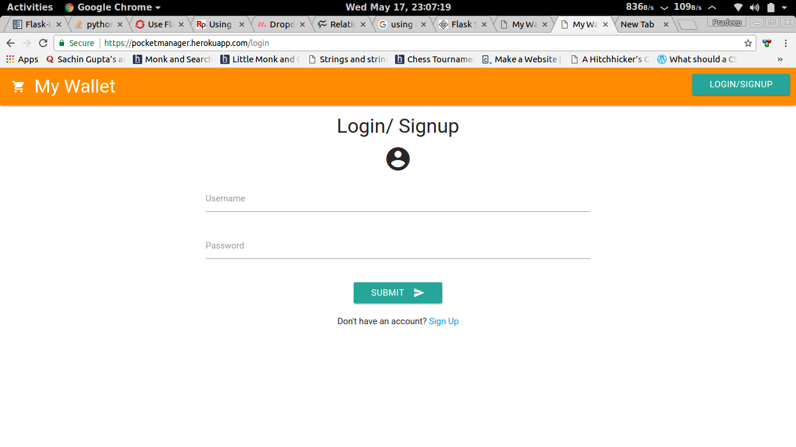
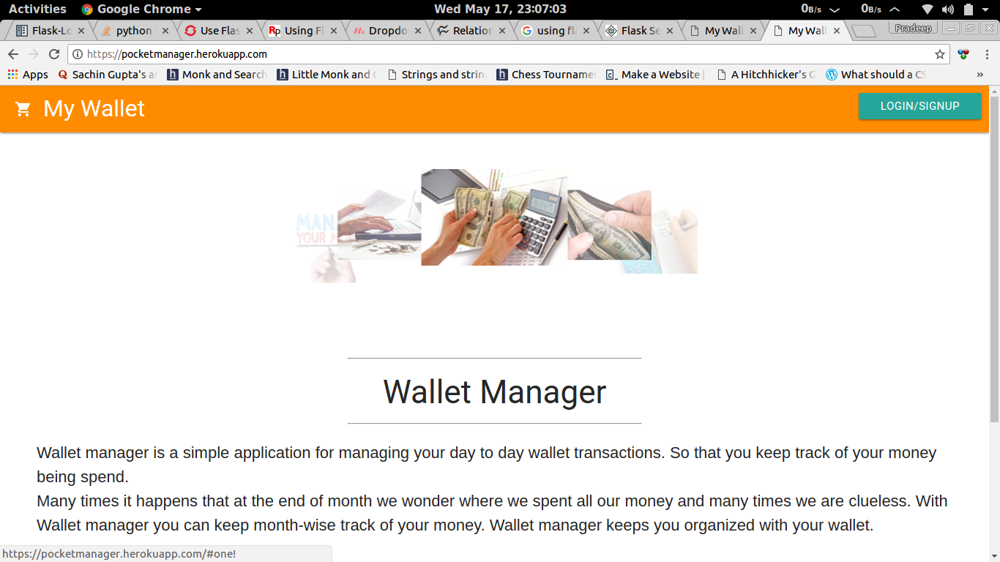

# This is a basic Wallet Manager type application

### This application uses Python based FLASK framework for its backend and Postgresql for database.

After activating virtual environment. Run following commands :

> pip install flask
> 
> pip install sqlalchemy
> 
> python app.py

You are good to go. Browse at *localhost:5000*.

Enjoy! :+1:

